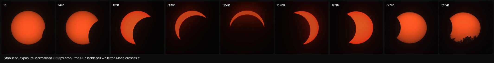
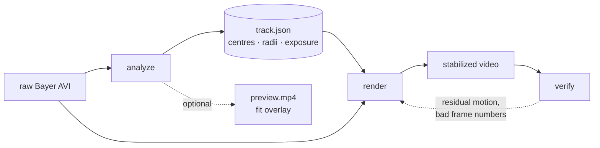
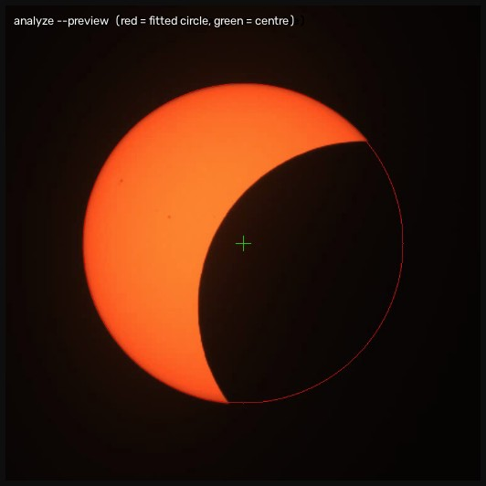
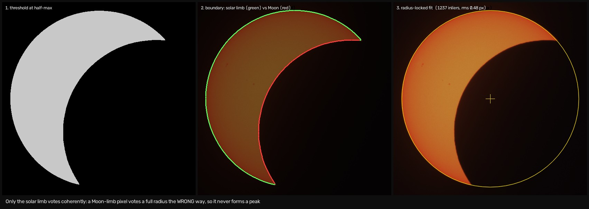
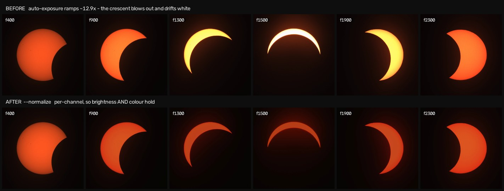
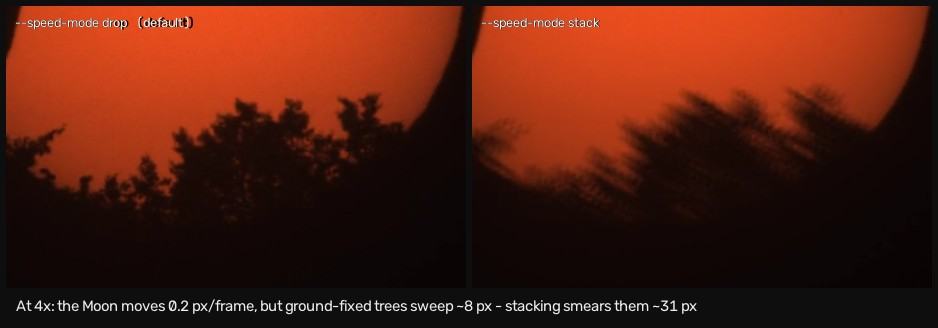
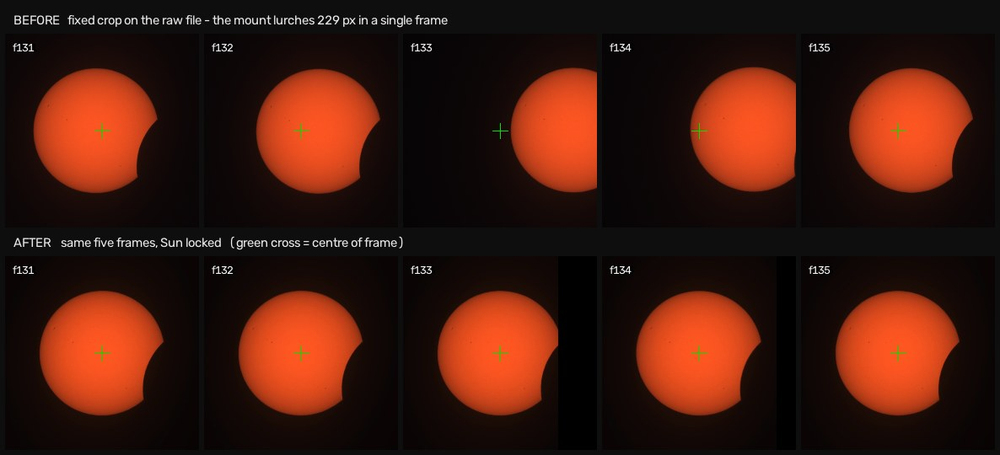

# solar-eclipse-timelapse-stabilizer

Lock the Sun to a fixed pixel in a partial-eclipse timelapse, undo the camera's
auto-exposure ramp, and cut the result — from a single Python script,
`eclipse_stabilize.py`.

Built for footage from a **Seestar S30 Pro** (IMX585, RAW8, Bayer GRBG) of the
~90% partial eclipse of 12 August 2026, but nothing in it is specific to that
mount beyond the defaults.

| | |
|---|---|
| **Input** | ~6 GB raw Bayer AVI, 1080×1920, 2959 frames |
| **Output** | Sun locked to **0.03 px** median frame-to-frame, photosphere brightness flat to **1.27×** (from 2.55×) |



---

## Why not a normal video stabilizer?

Warp Stabilizer, `vidstab` and friends all fail on this footage, for three
separate reasons:

1. **There is no texture to track.** A smooth disc on a black sky has no corners
   or features. Optical-flow and point-tracking stabilizers have nothing to lock
   onto.
2. **The brightness centroid is not the centre.** The obvious fallback — centre
   the bright blob — drifts steadily off as the Moon eats into the disc, because
   the centroid of a crescent is not the centre of the Sun it came from.
3. **The thing you want to hold still is a geometric object, not an image.** The
   Sun is a circle of known radius. That is far stronger information than any
   generic tracker can use.

So this script fits a **circle to the solar limb** instead, using only the limb
and explicitly rejecting the Moon's edge. The output is a measurement in pixels,
not a correlation — which means it can be checked, and it is (`verify`).

---

## Prerequisites

- **Python 3.9+**
- **numpy** and **opencv-python** — `pip install -r requirements.txt`
- **ffmpeg** on `PATH` — a system binary, not a pip package
  (`brew install ffmpeg` on macOS)

```bash
git clone <this repo> && cd solar-eclipse-timelapse-stabilizer
pip install -r requirements.txt
ffmpeg -version            # must succeed
```

Nothing else is needed. The script imports only `argparse`, `json`,
`subprocess`, `sys`, `cv2` and `numpy`.

---

## Quick start

```bash
# Pass 1 — measure the Sun's centre in every frame  ->  track.json
python3 eclipse_stabilize.py analyze input.avi --bayer gbrg \
    --track track.json --preview check.mp4

# Pass 2 — render the stabilised result
python3 eclipse_stabilize.py render input.avi --track track.json \
    --crop 800 --normalize -o stabilized.mp4

# Pass 3 — measure what is left
python3 eclipse_stabilize.py verify stabilized.mp4
```

`analyze` is the slow pass (~100 s for 2959 frames). It writes everything the
renderer needs into `track.json`, so you can re-render — different crop, trim,
speed, codec — as often as you like without re-analysing.



---

## Commands

### `analyze` — measure

Reads every frame, finds the Sun's centre, and records it. This is the only pass
that looks at the source pixels for measurement purposes.

| Option | Default | What it does |
|---|---|---|
| `input` | — | source video (raw Bayer AVI, or any video OpenCV can read) |
| `--track` | `track.json` | where to write the measurements |
| `--preview` | off | overlay video: fitted circle in red, centre cross in green. **Use it once** to confirm the fit is on the limb |
| `--threshold` | auto | fixed 8-bit grey level for the limb. Default is per-frame half-max, which is immune to exposure changes — leave it alone unless detection fails |
| `--min-inliers` | `40` | below this many limb points, the frame is recorded as undetected |
| `--radius-samples` | `120` | frames sampled to build the apparent-radius curve |
| `--bayer` | `none` | demosaic pattern — **see the table below** |

```
$ python3 eclipse_stabilize.py analyze input.avi --bayer gbrg --track track.json
1080x1920 @ 30.000 fps, 2959 frames
solar radius = 215.71 .. 259.88 px (255.78 at frame 0, 215.71 at the end)
exposure reference = frame 0, black level 5.0
detected in 2959/2959 frames (100.0%)
exposure level = 0.69 .. 4.32x reference (green channel), measured in 2958/2959 frames
wrote track.json
```



*`--preview` draws the fitted circle and centre on every frame. Note the circle
traces the **whole** solar disc, including the part behind the Moon — the centre
is never directly observable, which is exactly why it has to be fitted.*

#### The `--bayer` trap

OpenCV names its Bayer constants after the 2×2 block at **row 1, column 1** —
one pixel diagonally in from the pattern the sensor vendor quotes. So the flag
you pass is *not* your sensor's pattern:

| Sensor says | Pass |
|---|---|
| RGGB | `--bayer bggr` |
| BGGR | `--bayer rggb` |
| GRBG | `--bayer gbrg` ← Seestar S30 Pro |
| GBRG | `--bayer grbg` |

Check `--preview`: a blue or magenta disc means R and B are swapped (use the
partner of the pair); a fine checkerboard or maze texture means the phase is off
by one pixel (switch pairs entirely).

---

### `render` — produce the video

Applies the measured track, optionally corrects exposure, trims, speeds up, and
encodes. Cheap to re-run.

| Option | Default | What it does |
|---|---|---|
| `input` | — | the same source you analysed |
| `--track` | `track.json` | measurements from `analyze` |
| `-o`, `--output` | `stabilized.mp4` | output path; the extension picks the container |
| `--crop` | `0` (full frame) | output square size in px, centred on the Sun |
| `--start` | `0` | first source frame to render |
| `--end` | end | stop **before** this source frame, like a Python slice |
| `--speed` | `1` | whole-number speed-up; `2` halves the duration. Frame rate is unchanged |
| `--speed-mode` | `drop` | `drop` keeps the first frame of each group; `stack` averages the group |
| `--normalize` | off | undo the camera's auto-exposure ramp, per channel |
| `--codec` | `h264` | `h264` \| `prores` \| `ffv1` |
| `--crf` | `16` | H.264 quality, lower is better |
| `--despike` | `1` | `0` disables all outlier gating |
| `--max-jump` | `0` (auto) | hard px/frame limit. **Unconditional** — it will cut genuine fast motion too |
| `--smooth` | `0` | **leave at 0.** See "Decisions" below |
| `--bayer` | from track | override the pattern stored in `track.json` |

Two things worth knowing before you use it:

- **Trimming and speed are render-time only.** The track always covers the whole
  clip, so you can re-cut to a different `--end` as often as you like without
  re-running `analyze`. Skipped frames are stepped over with `cap.grab()`, never
  by seeking — the track is indexed by source frame number, and one silently
  inexact AVI seek would offset the entire thing. The despike gates still compute
  their medians over the whole track, so the numbers stay comparable between cuts.
- **`--normalize` needs the `exposure` record** that `analyze` writes into the
  track file. A track written before that record existed is refused with a
  message telling you to re-analyse.

```bash
# straightforward: centre crop, exposure corrected
python3 eclipse_stabilize.py render input.avi --track track.json \
    --crop 800 --normalize -o stabilized.mp4

# cut a ruined tail — verify prints the first bad frame number
python3 eclipse_stabilize.py render input.avi --track track.json \
    --crop 800 --end 2800 --normalize -o cut.mp4

# 4x faster
python3 eclipse_stabilize.py render input.avi --track track.json \
    --crop 800 --end 2800 --normalize --speed 4 -o fast.mp4

# editable master that QuickTime can actually open
python3 eclipse_stabilize.py render input.avi --track track.json \
    --crop 800 --end 2800 --normalize --codec prores -o master.mov
```

```
$ ... --crop 800 --end 2800 --normalize --speed 4
track: 2959 frames, motion 4.34 px/frame median, 229.49 max
  rejected 130 (4.4%): 0 undetected, 74 poor fit, 56 spikes
  normalize: gain 0.09..1.44 (per channel, black level 5.0)
  rendering frames 0-2799, trimming 159 of 2959
  speed 4x (drop): 2800 -> 700 frames, 23.3s
wrote fast.mp4 (700 frames, 23.3s at 30 fps)
```

#### Choosing a codec

| `--codec` | Container | Fidelity vs the pipeline's own frames | QuickTime |
|---|---|---|---|
| `h264` | `.mp4` / `.mov` | max error 39/255, mean 1.49 | yes |
| `prores` | `.mov` | max error **4**, mean 0.05 | **yes** |
| `ffv1` | `.mkv` | max error **0** (bit-exact) | **no** |

`prores` writes ProRes 4444 (`ap4h`, 10-bit 4:4:4) — no chroma subsampling to
band the low-contrast limb, and macOS decodes it natively. Use it for anything
you intend to grade or keep.

`ffv1` is mathematically lossless but **QuickTime cannot play it** — Apple never
shipped an FFV1 decoder, and AVFoundation reports `isDecodable = false`. Put it
in `.mkv` and treat it as a cold archive, not a viewing copy.

---

### `verify` — check the result

Re-detects the Sun in a **rendered** file and reports how much it still moves.
This is an independent measurement, not a replay of the track — which is the
point. Always verify against the rendered file, never the `--preview`.

```
$ python3 eclipse_stabilize.py verify stabilized.mp4
frames measured  : 2800 of 2800
radius           : 222.50 .. 260.28 px
drift about median: 0.12 px median, p99 3.61, peak 8.33
frame-to-frame   : 0.04 px median, p99 0.56, max 1.71
spike frames (7): 2689, 2690, 2691, 2692, 2699, 2700, 2784
-> locked apart from 7 bad frames; these are the flicker.
```

How to read it:

- **frame-to-frame median** is the number that matters. Under ~0.3 px is locked.
- **spike frames** are frames that moved more than `max(1 px, 20× the median)`.
  With a median of 0.04 px that threshold is just 1 px, so short lists of
  sub-2 px spikes are noise, not visible flicker.
- `verify` re-detects on the rendered file, so it measures **content quality as
  well as alignment**. Frames where the Sun is genuinely obscured (cloud,
  branches) will always fail. Look at them before touching any gate.
- It reads a `--normalize`d file slightly worse than a plain one, because
  rescaling moves its half-max contour. The warp is identical either way — a
  direct phase correlation between the two renders gives 0.02 px, so trust that
  over `verify` here.
- It measures its own radius curve before re-detecting, for the same reason
  `analyze` does. Run this detector against a single radius and it goes bistable
  late in the clip and reports its own flip-flopping as spikes — that was a large
  part of the 459 spikes in the "before" column below.

---

## The track file

`analyze` writes plain JSON, so you can inspect or hand-edit it.

| Key | Meaning |
|---|---|
| `width`, `height`, `fps` | source geometry |
| `radii` | apparent solar radius **per frame** (see below) |
| `radius` | median of `radii`, for reference |
| `track` | per frame: `[cx, cy, inlier_count, fit_rms]`, or `null` if undetected |
| `exposure` | per frame: `[B, G, R]` brightness relative to the reference frame |
| `black` | black level used by `--normalize` |
| `bayer`, `threshold` | what `analyze` was told to use |

---

## How it works

### 1. Limb extraction

Blur, then threshold at **half-max relative to the disc's own brightness** —
midway between the median sky and the median disc. Because the threshold is
defined by the disc itself, auto-exposure and haze changes do not move the
apparent limb from frame to frame.

Boundary pixels are the mask minus its erosion. Each one is then slid along its
own intensity gradient to where the intensity actually crosses the threshold,
giving a sub-pixel position. Integer-snapped limb points are the single biggest
source of residual jitter once the large shakes are gone.

The boundary is subsampled **deterministically** (every *n*-th point), never
randomly — a random subset differs frame to frame and injects its own jitter.

### 2. Gradient-oriented Hough vote

Each limb pixel votes for a centre one radius back along its inward normal.

This is what keeps the Moon out of the fit. A pixel on the lunar terminator has
its bright→dark normal pointing *into* the Moon, so its vote lands a full radius
on the far side of the Moon's centre — scattered around a ring of radius
`R_moon + R_sun`. Only the solar limb votes coherently, so the accumulator has
exactly one sharp peak.

### 3. Locked-radius circle fit

A Gauss-Newton fit refines the vote peak, solving **only for position**. The
radius is held fixed.

This matters enormously on a thin crescent. With the radius free (an algebraic
Kasa fit), centre and radius trade off against each other, and because the
visible arc is short the fitted centre slides along the arc's axis — worst
exactly at deepest eclipse, where you least want it.



*The Moon's edge is in the boundary set (red) and is simply not allowed to pull
the fit. Rejecting it is geometric, not a heuristic: a Moon-limb pixel's
bright→dark normal points into the Moon, so its vote lands a full radius on the
far side and joins a diffuse ring instead of the peak.*

### 4. The radius curve

The radius is locked **per frame, to that frame's own value**, taken from a
smooth curve measured across the whole clip.

The apparent half-max radius is not constant. On the reference clip it runs
255.8 px at the start, 260 at deepest eclipse, then falls to 216 by the end — an
11% swing, as the Sun drops toward the horizon and extinction pulls the half-max
contour inward. `radius_curve` samples ~120 frames, rejects samples taken through
cloud or branches, smooths, and interpolates to every frame.

### 5. Rejection and interpolation

Frames are rejected on **fit quality** (inlier count, fit RMS) and on
**curvature** — the second difference of the position track. Real mount motion
is smooth in position however fast it is; a single mis-fit frame is a one-frame
kink.

Rejected frames are linearly interpolated across. Good frames are never touched.

### 6. Warp

Debayer first, then warp — sub-pixel interpolation on a mosaiced frame destroys
the pattern irrecoverably. The shift is applied with Lanczos-4 interpolation and
a hard black border.

### 7. Exposure normalisation (`--normalize`)

The camera's auto-exposure ramps ~12.9× as the Moon covers the disc. To undo it,
the script measures the photosphere's brightness in every frame against a
**limb-darkening profile** `I(ρ)` taken from the least-eclipsed frame, comparing
like with like at each fractional radius ρ.



Three details make it work:

- **Step back from the Moon's limb.** The lunar edge is not hard at this scale;
  pixels within several px of it are partly covered and read low. At deepest
  eclipse nearly the whole crescent sits in that band. The mask is eroded ~8 px.
- **Compare at matched ρ.** During deep partial phases only the outer limb is
  visible, and the limb is intrinsically darker than disc centre. Comparing a
  crescent's average against a whole-disc average over-brightens it badly.
- **Correct per channel.** R saturates long before G and B, so as the exposure
  climbs the recorded hue drifts orange → white. A single luminance gain
  preserves that drifted hue and merely darkens it.

---

## Decisions worth knowing about

Each of these was a live bug at some point, and each looked like reasonable code.

**Do not smooth the track.** Shifting each frame so a *smoothed* path lands at
centre is the camera-stabilisation recipe, and it is wrong here: it leaves
`measured − smoothed` in the output as visible wobble. There is no intentional
camera motion to preserve — shift by the measured position itself. `--smooth`
exists but must stay `0`.

**Do not estimate the radius from disc area.** `sqrt(area/π)` assumes some frame
shows an uneclipsed disc. On eclipsed-only input it read 44.6 px against a true
60 px.

**One radius for the whole clip makes the fit bistable.** With a circle ~15 px
too big, hugging the top arc and hugging the bottom arc are both stable optima
with comparable inlier counts and RMS — the wrong one sometimes has *more*
inliers, so no fit-quality gate can separate them. The centre then flips by twice
the radius error (~30 px) between neighbouring frames. Hence the per-frame radius
curve.

**Curvature alone must not condemn a frame.** This mount really does lurch:
frames 117–119 and 131–135 move 50–229 px in a single frame, and phase
correlation on the source confirms every one as real image motion. Those frames
fit beautifully. Rejecting them interpolated straight through the lurch and left
the Sun **302 px off centre** — the single worst shake in the output was
manufactured by the despiker, not the mount. The curvature gate now only fires on
frames whose fit is *also* below par.

**Match the observed level, not the true exposure.** Correcting by the real
exposure ratio is right only while the sensor has headroom. At deepest eclipse
the crescent is pinned at 255 (99.7% of it in R, 93% in G), so dividing by the
true 12.9× would render it near black. Including saturated pixels in the estimate
degrades gracefully instead.

**Do not smooth the exposure track either.** Same trap, one layer down. A rolling
median looks free, but the per-frame estimate is already stable to 0.17%
frame-to-frame, and on a source whose exposure genuinely varies per frame it
destroys the correction outright.

**`--speed-mode drop`, not `stack`.** Averaging groups of frames is valid here —
the Sun is locked to 0.04 px, so a stack is properly registered, and it does cut
noise 1.5× at 4×. But stabilising on the Sun sets *everything attached to the
ground* moving: foreground trees sweep ~8 px per source frame against ~0.2 px for
the Moon's limb. A 4× stack blurs the Moon by an invisible 0.8 px and the trees
by ~31 px. The noise it buys back is sub-LSB at 8 bit and invisible.



**Choose the pixel format per codec.** Setting `-pix_fmt yuv420p` once for every
codec silently made the lossless path lossy — RGB was converted to 8-bit 4:2:0
*before* FFV1 saw it, so the "archive" was a bit-exact copy of already-damaged
data (max error 22/255, 85% of pixels wrong). It was less faithful than ProRes
4444 and unplayable as well.

**Phase correlation is the arbiter.** When the track disagrees with your
intuition about whether a frame really moved, cross-correlate the two source
frames directly (`cv2.phaseCorrelate` on a Hann-windowed crop). It is independent
of the circle fit, so it settles "real motion or bad fit?" in one step — and its
response value tells you when to distrust it.

---

## Results on the reference clip



*The black slivers on `f133`/`f134` in the lower row are real: the mount moved so
far that the 800 px crop runs past the edge of the source. Three frames out of
2959 are affected — the alternative was a 229 px jump.*

2959 frames, `--crop 800`:

| | before | after |
|---|---|---|
| drift about median | 0.18 px median, peak 301.6 | 0.03 px median, peak 83.0 |
| frame-to-frame | 0.05 px median, max 226.6 | 0.03 px median, max 81.4 |
| spike frames | 459, spread throughout | 139, all at frame 2707+ |

Everything still flagged is the Sun setting behind trees at the end of the clip.
Cut to `--end 2800`, the same render measures 0.12 px median drift and 1.71 px
maximum frame-to-frame, with no frame overridden by the despiker. That cut —
`--crop 800 --end 2800 --normalize` — is the delivered version: 2800 frames,
93.3 s, ending on a real treeline, with `--speed 2` and `--speed 4` variants at
46.7 s and 23.3 s.

With `--normalize`, photosphere luminance goes from 98–250 (2.55× spread, stdev
51.0) to 92–117 (**1.27×, stdev 7.2**), and the hue holds: R 182–234, G 60–75,
B 22–29, against R 208–254, G 55–249, B 27–248 uncorrected. The residual dip at
maximum is real — only the intrinsically darker extreme limb is visible then.

---

## Limitations

- **Field rotation is not corrected.** On an alt-az mount the field rotates over
  the sequence, so once the disc is locked the Moon's bite swings around. Fixing
  it needs a rotation solve — parallactic angle from time and pointing, or
  tracking a sunspot — not more translation work.
- **Blown highlights cannot be recovered.** From roughly frame 1350 to 1900 the
  crescent is in hard saturation. `--normalize` puts it at the right brightness
  and colour, but the detail was never captured.
- **White balance is not corrected.** The disc reads orange after debayer.
  `--normalize` pins every frame to the *reference frame's* balance, so it
  removes the drift but keeps the cast. Fix downstream.
- **`--normalize` gains can exceed 1** near the end of a clip that finishes
  dimmer than its reference, which introduces new clipping (2.0% of frame at the
  very end of the reference clip).
- **Foreground objects are not stabilised** — by definition. Locking the Sun
  makes the ground move.

---

## Testing

There are no real-data fixtures in the repo. Validation is synthetic: render a
disc plus an occulting disc at 4× and downsample, add per-frame exposure
variation and noise, then compare recovered centres against known truth.

This is worth keeping. Most of the bugs listed above were caught this way rather
than by eye — including the exposure-smoothing bug, which made the synthetic
clip come out no flatter than uncorrected while looking perfectly fine on the
real footage.

On the current synthetic case — a 20% radius drift, per-frame exposure jitter,
four deliberate 40-70 px lurches and a moving occulter — the recovered centre
carries **0.11 px of jitter** (stdev, x) about a 0.52 px constant bias, and the
radius curve recovers the 120 px -> 100 px drift to within 0.4 px. For comparison,
the same clip through a single locked radius gives 8.9 px of jitter.
